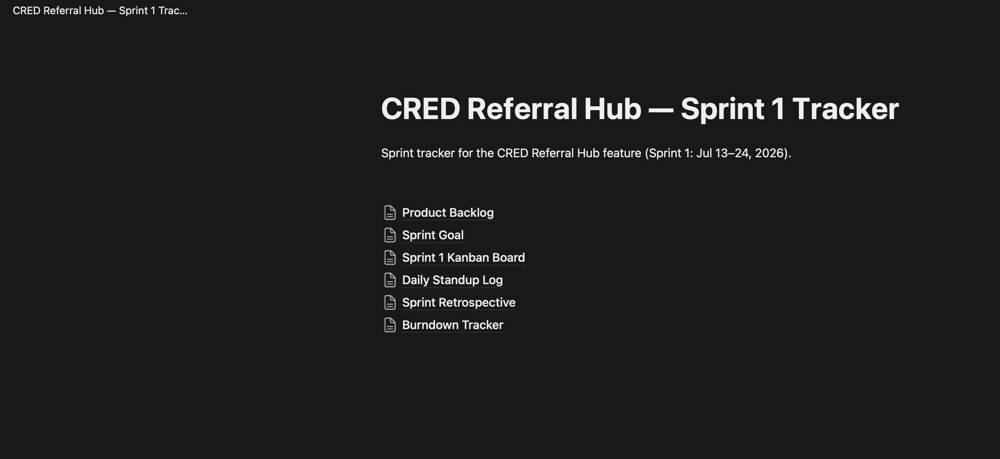
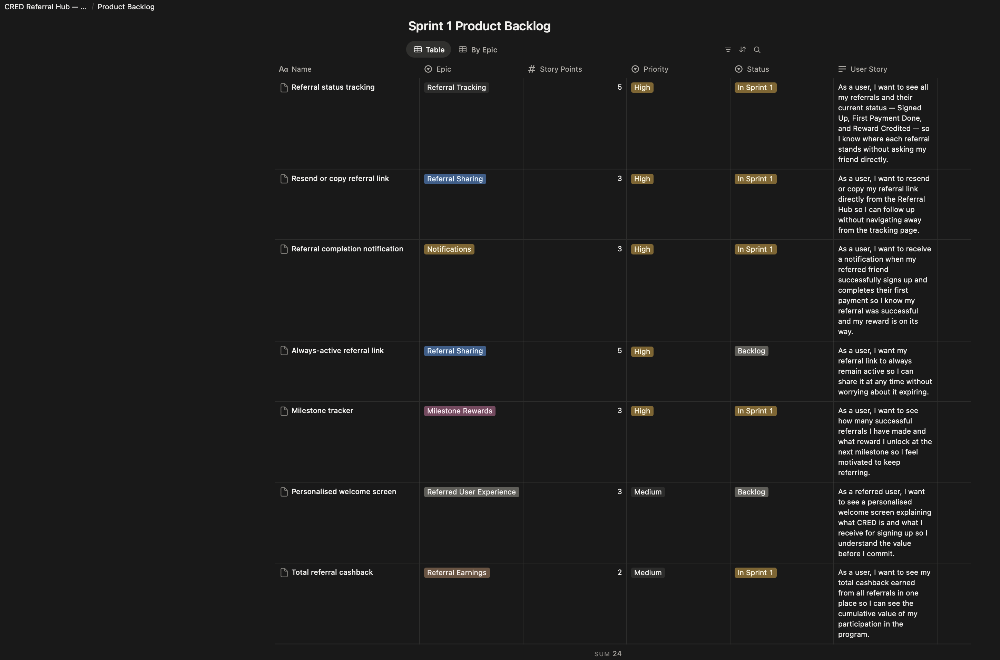
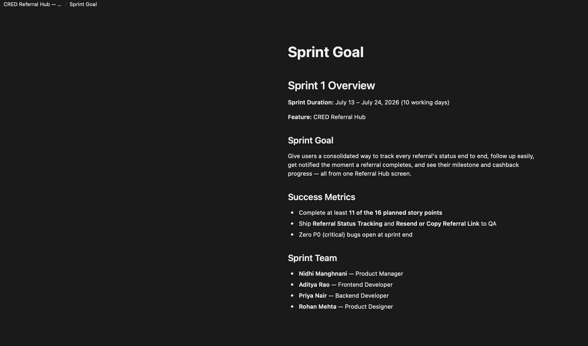
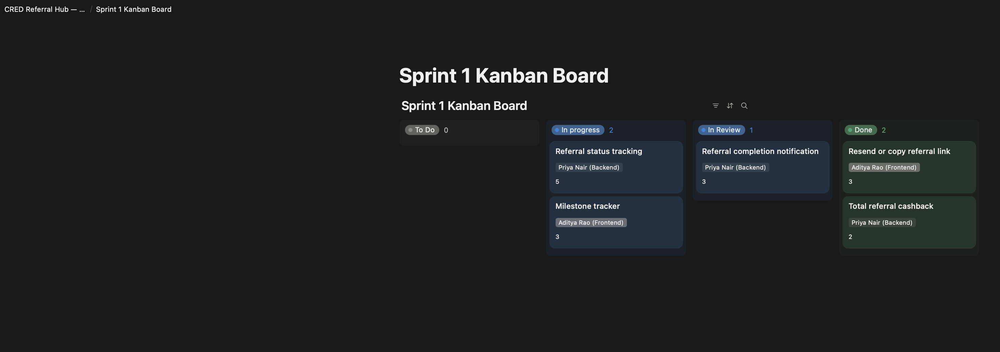
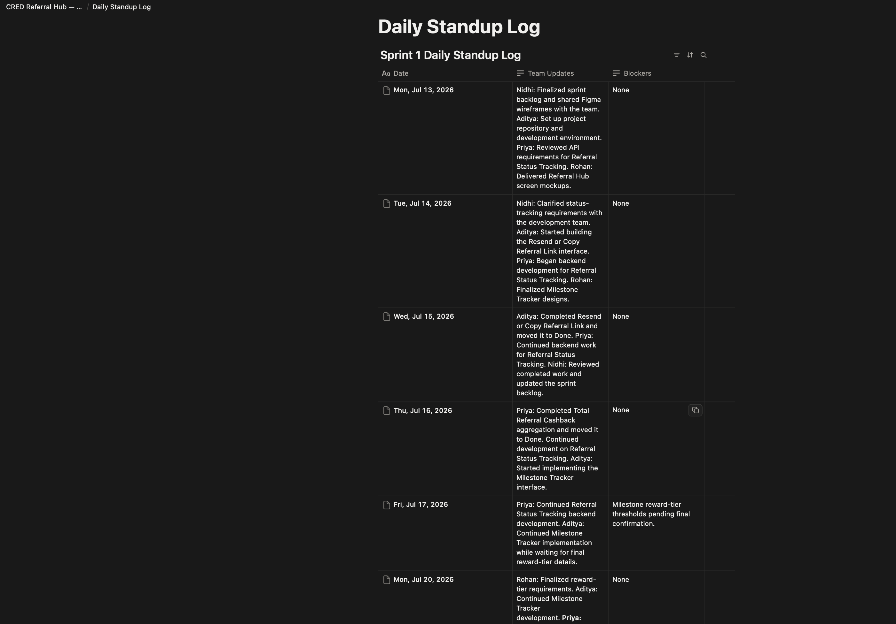
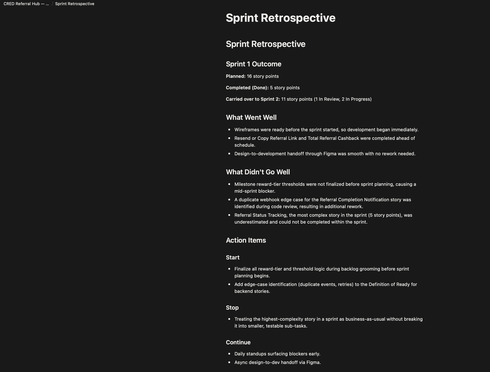
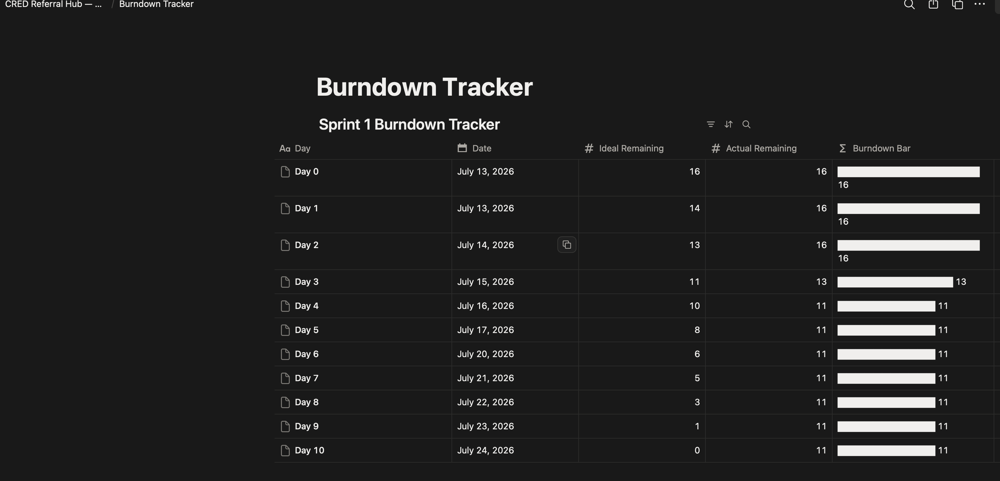

# Project 3: CRED Referral Hub — Agile Sprint Tracker (Notion)

## Overview

A simulated 2-week Agile sprint for the **CRED Referral Hub** feature, built directly from the user stories defined in **Project 2: CRED Product Teardown & PRD**.

This project demonstrates the end-to-end Product Management sprint workflow, including backlog grooming, sprint planning, sprint execution, daily standups, a Kanban board, a burndown tracker, and a sprint retrospective.

**🔗 Live Notion Workspace:** https://inky-seeker-09d.notion.site/CRED-Referral-Hub-Sprint-1-Tracker-39c64bd33a4a803b8a13c9df81c89877?source=copy_link

---

## Sprint Details

- **Sprint Duration:** July 13 – July 24, 2026 (10 working days)
- **Sprint Goal:** Give users a consolidated way to track every referral's status end to end, follow up easily, get notified the moment a referral completes, and view their milestone and cashback progress from a single Referral Hub screen.
- **Team:**
  - Nidhi Manghnani — Product Manager
  - Aditya Rao — Frontend Developer
  - Priya Nair — Backend Developer
  - Rohan Mehta — Product Designer
- **Sprint Summary:**
  - Planned: **16 story points**
  - Completed: **5 story points**
  - Carried over to Sprint 2: **11 story points**

---

## What's Included

| Artifact | Description |
|----------|-------------|
| Product Backlog | Seven user stories across six epics, carried over from the Project 2 PRD, with priorities and story points. |
| Sprint Goal | Sprint objective, scope, success metrics, and team members. |
| Sprint 1 Kanban Board | Visual workflow showing stories across To Do, In Progress, In Review, and Done. |
| Daily Standup Log | Ten working days of standup updates, progress, blockers, and resolutions. |
| Sprint Retrospective | Sprint outcomes, lessons learned, and action items for Sprint 2. |
| Burndown Tracker | Ideal versus actual remaining story points tracked throughout the sprint. |

---

## Tools Used

- Notion

---

## Connection to Project 2

This sprint executes the same **CRED Referral Hub** user stories defined in **Project 2: CRED Product Teardown & PRD**.

Instead of creating a new backlog, the Project 2 PRD was transformed into sprint-ready work by:
- prioritizing user stories,
- estimating story points,
- planning Sprint 1,
- tracking daily execution,
- monitoring progress through a Kanban board and burndown tracker, and
- reviewing outcomes in a sprint retrospective.

This demonstrates how a Product Manager converts product requirements into an executable Agile sprint.

---

## Screenshots

### Parent Page

### Product Backlog

### Sprint Goal

### Sprint 1 Kanban Board

### Daily Standup Log

### Sprint Retrospective

### Burndown Tracker
