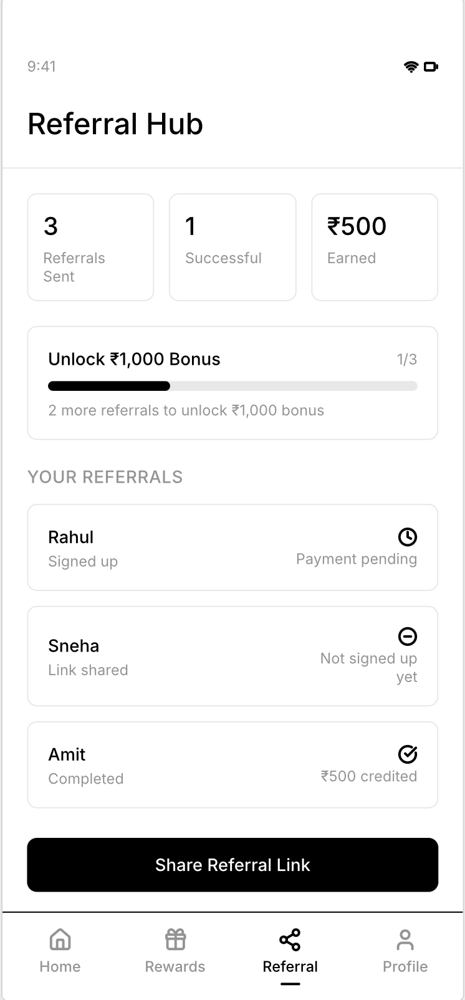
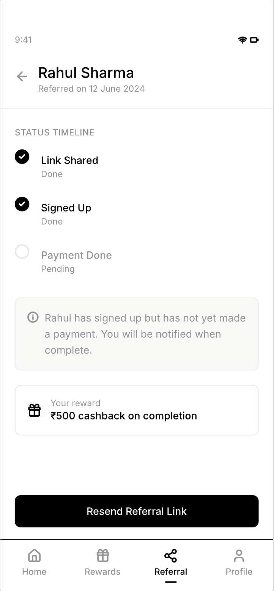

# Project 2: CRED Product Teardown + Mini PRD
**Tools:** Google Docs
**Type:** Product Management
---
## Overview
Teardown of CRED — India's premium fintech rewards app.
Analysed target users, core features, monetisation model,
key metrics, and product gaps. Followed by a Mini PRD
proposing CRED Referral Hub — a structured, trackable,
always-on referral experience to replace the existing
basic refer-and-earn flow.
---
## Document
[CRED_Teardown_and_PRD.pdf](./CRED_Teardown_and_PRD.pdf)
---

## Wireframes
**Screen 1 — Referral Hub Home**

**Screen 2 — Referral Detail**

---
## Teardown Summary
- CRED monetises through brand partnerships, lending
  products, and travel commissions — not user fees
- Core loop: pay bill → earn coins → redeem rewards
  → return next month
- Exclusively targets users with credit score above 750
  — making its user base uniquely valuable to advertisers
  and lenders
---
## PRD Summary
- **Feature:** CRED Referral Hub — always-on referral
  tracking with status dashboard, milestone rewards,
  and nudge notifications
- **Gap Identified:** Referral program exists but offers
  limited visibility into the full referral journey, links
  expire in 48 hours and
  runs only as occasional campaigns — not a permanent
  feature
- **User Stories:** 7 stories covering status tracking,
  resend from dashboard, completion notifications,
  permanent links, milestone rewards, referee onboarding,
  and earnings summary
---
## Goals
| Goal | Metric | Target |
|---|---|---|
| Increase referral-driven signups | New signups from referral links per month | +25% in 3 months |
| Drive Referral Hub adoption | % of MAU who send at least one referral | 20% of MAU in 2 months |
| Ensure milestone rewards are claimed | % of users who claimed reward within 7 days of milestone | 80% claim rate |
| Drive return visits to Referral Hub | % of referrers who check status within 7 days | 50% return at least once |